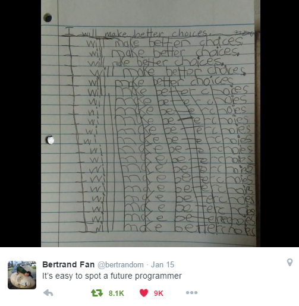
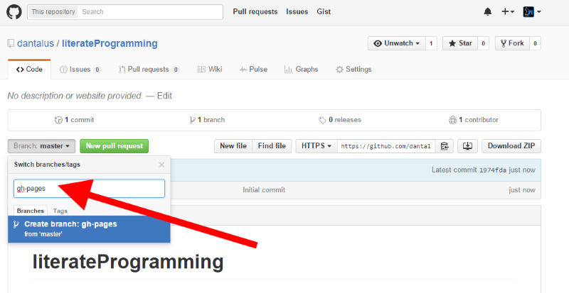
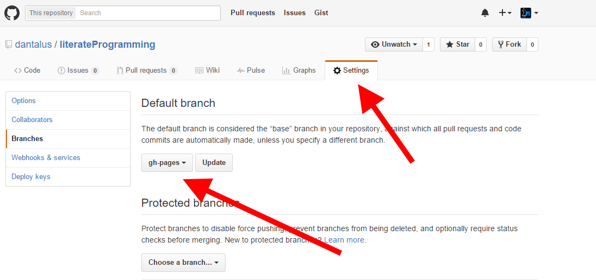
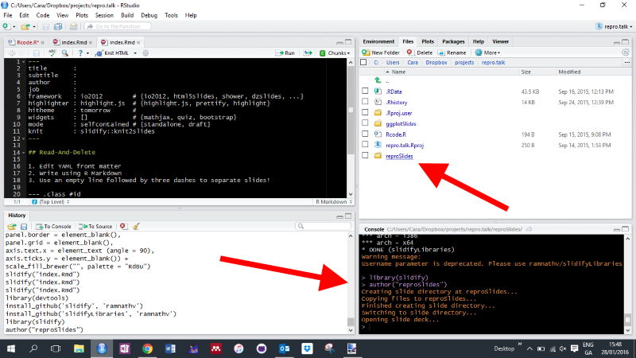
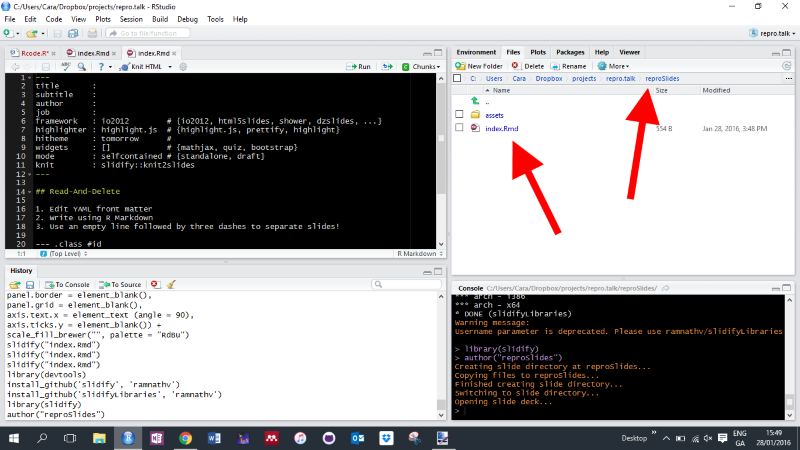

<br>
<br>
<center></center>
<br>
<br>

---

<br>
<br>
<center></center>
<br>
<br>

---

<br>
<br>
<center></center>
<br>
<br>

---

<br>
<br>
<center></center>
<br>
<br>

---

<br>
<br>
<center></center>
<br>
<br>

---

## Slidify


```r
# library(devtools)
# install_github('slidify', 'ramnathv')
# install_github('slidifyLibraries', 'ramnathv')

  library(slidify)
  author("reproSlides")
```

```
## Creating slide directory at reproSlides...
```

```
## Copying files to reproSlides...
```

```
## Finished creating slide directory...
```

```
## Switching to slide directory...
```

```
## Opening slide deck...
```

---

<br>
<br>
<center></center>
<br>
<br>

---

<br>
<br>
<center></center>
<br>
<br>

---


